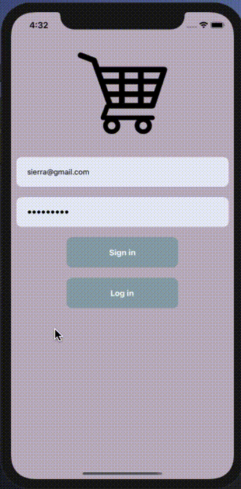
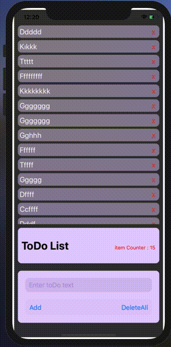

# React Native Portfolio Building

Purpose of the this portfolio building will include my React Native Projects 

##  Waiting Outcomes of This Repository

- Understand components structure

- Understand styling basics

- From Basic to High Level React library Usage

## Outline

- Part 1 - Components
  
- Part 2 - Styling
  
- Part 3 - Views & Text
- - ListViews (Flat List and Section List)
- - Scroll View & Text Input

- Part 4 -Button & Modals
- - TouchableOpacity
- - TouchableHighlight
- - TouchableNativeFeedback
- - TouchableWithoutFeedback
- - Modals
- - Alert
  
- Part 5 - React Native Lifecycle
- - The Component Lifecycle
- - Mount
- - Updating
- - Unmounting

- Part 6 - React Navigation
- - NavigationContainer 
- - createStackNavigator
- - Stack.Navigator
- - Stack.Screen

- Part 7 - Other Elements/API
- - Image
- - Animated
- - ActivityIndicator 
- - StatusBar  
- - Switch 
- - ImageBackground

- Part 8 - React Redux
  
---
##  React-Native Projects

<table>
<tr>
  <th> Project-008 </th>
  <th> Project-009 </th>
  <th> Project-010 </th>
</tr>

<tr>
  <td>
  <p align ='center'> Project 009 - News Page <p>
  
  </td>
  
  <td>
  <p align ='center'>Project 010 - Login Page </p>
  
  </td>

  

  <td>
  <p align ='center'> Project 011 - To-Do App</p>
  
  </td>
</tr>
</table>

---


<table>
<tr>
  <th>Practice 001
  <th>Practice 002
  <th>Practice 003
</tr>
  <td>
  <p align ='center'> ClarusShopping Page <p>
  
  </td>
  <td>
  <p align ='center'> ReverseFunctions <p>
  
  </td>
  <td>
  <p align ='center'> First News Practice <p>
  
  </td>

</table>
---

<!-- # Practice 001 - ShoppingPage

- 

---
# Project 009 - News Page
- 

---
# Project 010 - Login Page
! [Project 008 Login Page](./images/Screen%20Shot%202020-10-12%20at%2023.29.37.png)

---
# Project 011 - To-Do App
-  -->

## Happy Coding!


### The easiest way to convert your screenrecording to gif.


- Save your screen recording as the name ' in.mov'
- open a terminal at the same folder in.mov file.
- if not installed this do these firs
brew install ffmpeg 
brew cask install xquartz #dependency for gifsicle, only required for mountain-lion and above
open /usr/local/Cellar/x-quartz/2.7.4/XQuartz.pkg # runs the XQuartz installer (YOU NEED TO UPDATE THE PATH)
brew install gifsicle
- paste this command line to your terminal 
  ffmpeg -i in.mov -s 600x400 -pix_fmt rgb24 -r 10 -f gif - | gifsicle --optimize=3 --delay=3 > out.gif


  <!-- ```c++
int foo() {
    int result = 4;
    return result;
}
``` -->

```c++
int foo() { 
    int x = 4;
    return x;
}
```
